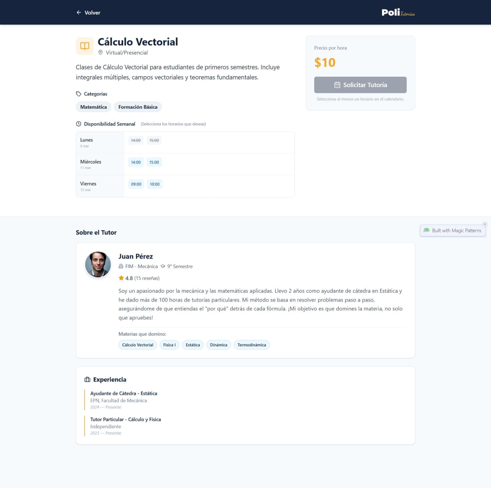

# HU32 - Ver detalles de la oferta

## Información de la Historia de Usuario

| **Sección** | **Descripción** |
| :--- | :--- |
| **Estimación** | 5 SP |
| **Historia de Usuario** | Como estudiante, quiero ver los detalles de una oferta para tomar una decisión informada. |

---

# HU32 - Criterios de Aceptación

| **Escenario** | **Descripción** |
| :--- | :--- |
| **Visualización de Detalles de Oferta** | **Dado** que el estudiante está en la sección de búsqueda de tutorías   **cuando** hace clic en una tarjeta de oferta   **entonces** se carga la información detallada de la oferta, mostrando en la cabecera el botón 'Volver' a la izquierda y el logo 'PoliTutorias' a la derecha. La sección principal muestra el icono de libro junto al título de la materia 'Cálculo Vectorial', la modalidad 'Virtual y Presencial', una descripción de la clase, las 'Categorías' con los tags 'Matemática' y 'Formación Básica', y la 'Disponibilidad Semanal' con los horarios para Lunes de 14:00 a 15:00, Miércoles de 14:00 a 15:00 y Viernes de 09:00 a 10:00. En el panel lateral, se visualiza el 'Precio por hora' de $10. |
| **Regreso a la Lista de Ofertas** | **Dado** que el estudiante está visualizando los detalles de una oferta de tutoría   **cuando** hace clic en el botón 'Volver' en la cabecera superior izquierda   **entonces** es redirigido a la pantalla principal de listado de ofertas. |

## Frames del Prototipo

### E. Detalle Oferta

**Frame ID**: [1hPAk_Drn-X1VKl5dhcaE2GrgAGFwkhvJ](https://drive.google.com/file/d/1hPAk_Drn-X1VKl5dhcaE2GrgAGFwkhvJ/view?usp=drivesdk)

## Observaciones

Descartar la sección completa "Sobre el Tutor", "Experiencia" y "Contactar por WhatsApp". Enfocarse estrictamente en mostrar los detalles de la oferta de una tutoría: Título de la oferta, modalidad, Categoría, Disponibilidad Semanal y precio por hora.
